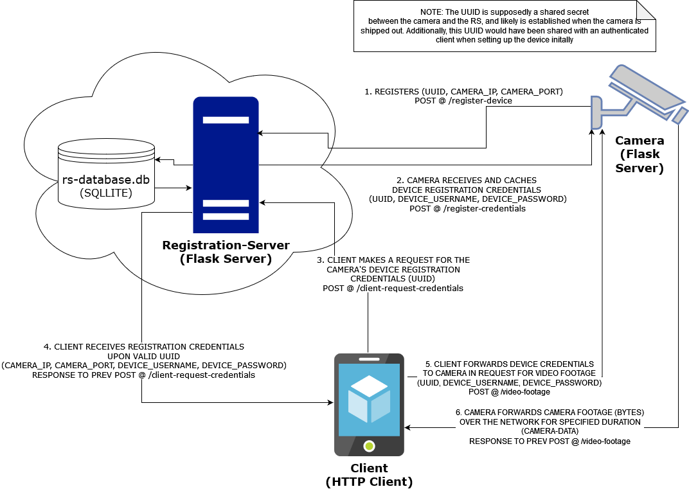
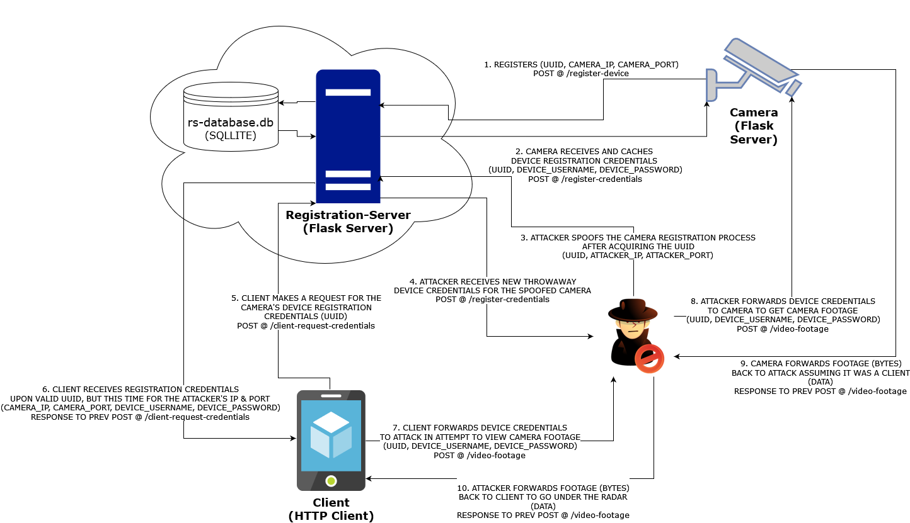

# Throughtek-Kalay-Mock-Attack

## OVERVIEW
    AUTHOR: Alexander Castro
    DESCRIPTION: Mock Implementaion of the Vulnerable ThroughTek-Kalay MiTM Attack
    PURPOSE: CYSE-580 Technical Demonstration

---

## REFERENCES

    NEWS: 
     - https://thehackernews.com/2021/06/critical-throughtek-flaw-opens-millions.html 
     - https://aws.plainenglish.io/the-throughtek-kalay-vulnerability-is-absolutely-absurd-heres-why-it-should-worry-you-fe222549dd0d  
     - https://industrialcyber.co/news/critical-vulnerability-found-in-throughtek-kalay-p2p-sdk-can-remotely-exploit-millions-of-iot-devices/ 
     - https://techxplore.com/news/2021-08-vulnerability-iot-devices-throughtek-kalay.html 
     - https://www.mandiant.com/resources/blog/mandiant-discloses-critical-vulnerability-affecting-iot-devices 

    MODELS: 
    - https://threatpost.com/bug-iot-millions-devices-attackers-eavesdrop/168729/ 

    CVE:  
    - https://unit42.paloaltonetworks.com/iot-supply-chain-cve-2021-28372/  

    CISA Report: 
    - https://www.cisa.gov/news-events/ics-advisories/icsa-21-229-01 

---

## Components:

    Registation-Server
        - Mock implementation of a Kalay cloud server that tracks the registration of IoT devices
          using a stateful datastore (sqlite3). 
        - Camera devices can register themselves with this server and they will recieve back their
          registration creds
        - Clients will need to request for camera device creds using the secrect UUID, before
          they're able to request for camera footage. 
    
    Camera
        - Mock implementation of a registered IoT device that captures audio/video footage and 
          serves it up to authenticated users. 
        - Requires (device-UUID, device-username, device-password) for proper authentication
    
    Client
        - Mock implementation of a authenticated mobile application that would be used to remotely
          view the camera footage
        - Requests for the camera device creds from the registration server and provides those 
          creds to the camera to start recieving a stream of camera footage
    
    Attacker
        - Spoofed camera that can act as a middle man in the communication between the client and the camera
        - This is done by registering itself with the same UUID as the target camera, so that whenever a client
          goes to request device creds, it will be directed at the attacker
        - The attack will then forward the creds given to it by the client to the camera in order to spy on the 
          camera footage. The attack will also fork a copy of the camera feed and forward it back to the client 
          in order to remain under the radar

---

## Normal Transaction

---

## Attacker Interception
